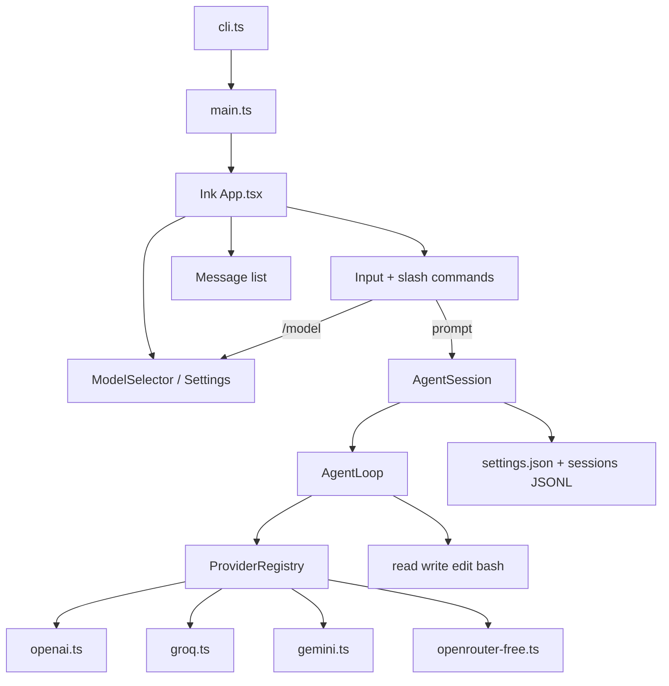

# Ink-based AI Agent Harness (pi-like)

## Goal

Create a working terminal coding agent in `d:\projects\Agent-Dev` modeled after [pi's coding-agent](https://github.com/earendil-works/pi/tree/main/packages/coding-agent), but using **Ink + React** for the UI instead of pi's custom `@earendil-works/pi-tui`.

Core user flows:
- Interactive chat with tool execution (read, write, edit, bash)
- `/model` — pick provider + model (overlay selector)
- `/settings` — thinking level, theme, API key hints
- Four provider families with **full implementation code**:
  1. **OpenAI** (ChatGPT) — `gpt-4o`, `gpt-4o-mini`
  2. **Groq** — `llama-3.3-70b-versatile`, `openai/gpt-oss-120b`
  3. **Google Gemini** — `gemini-2.0-flash`, `gemini-2.5-flash`
  4. **Free (OpenRouter)** — free-tier models e.g. `meta-llama/llama-3.3-70b-instruct:free`, `google/gemini-2.0-flash-exp:free`

## Architecture



## Project layout

```
d:\projects\Agent-Dev\
├── package.json
├── tsconfig.json
├── README.md
├── bin/
│   └── agent.js          # CLI entry (compiled)
└── src/
    ├── cli.ts            # shebang entry → main()
    ├── main.ts           # parse args, start Ink
    ├── config/
    │   ├── paths.ts        # ~/.agent-dev/ config dir
    │   ├── settings.ts     # load/save settings.json
    │   └── models.ts       # static model catalog per provider
    ├── providers/
    │   ├── types.ts        # Model, ProviderId, StreamEvent, Message
    │   ├── registry.ts     # resolve provider + stream()
    │   ├── openai.ts       # OpenAI Chat Completions (ChatGPT)
    │   ├── groq.ts         # Groq OpenAI-compatible API
    │   ├── gemini.ts       # Google Generative AI
    │   └── openrouter-free.ts  # OpenRouter free models
    ├── agent/
    │   ├── loop.ts         # tool-call loop (pi agent-loop pattern)
    │   ├── session.ts      # AgentSession: prompt, setModel, events
    │   └── tools/
    │       ├── index.ts
    │       ├── read.ts
    │       ├── write.ts
    │       ├── edit.ts
    │       └── bash.ts
    ├── session/
    │   └── manager.ts      # JSONL session persistence
    └── ui/
        ├── App.tsx         # root Ink app + state
        ├── ChatView.tsx    # messages, tool calls, streaming
        ├── Editor.tsx      # input, @files stub, slash autocomplete
        ├── Footer.tsx      # cwd, model, token/cost stub
        ├── ModelSelector.tsx   # /model overlay (fuzzy filter)
        ├── SettingsView.tsx    # /settings overlay
        └── theme.ts
```

Config directory: `~/.agent-dev/` (mirrors pi's `~/.pi/agent/` pattern).

## Key dependencies

| Package | Purpose |
|---------|---------|
| `ink`, `react` | Terminal UI |
| `openai` | OpenAI + Groq + OpenRouter (all OpenAI-compatible) |
| `@google/genai` | Gemini native API |
| `typebox` | Tool JSON schemas |
| `chalk` | colored stderr / print mode |
| `tsx` / `typescript` | dev + build |

Node >= 20.

## Provider implementations (all four, separate files)

Each provider module exports:
- `PROVIDER_ID`, `DEFAULT_MODEL`, `MODELS[]`
- `getApiKey()` — env var → `settings.json` → prompt in `/settings`
- `streamChat(model, messages, tools, options)` — async generator of `StreamEvent` (text delta, tool_call, done, error)

### 1. OpenAI — [`src/providers/openai.ts`](src/providers/openai.ts)

- Base URL: `https://api.openai.com/v1`
- Env: `OPENAI_API_KEY`
- Models: `gpt-4o`, `gpt-4o-mini`
- Uses `openai` SDK `chat.completions.create` with `stream: true`, tool_calls support

### 2. Groq — [`src/providers/groq.ts`](src/providers/groq.ts)

- Base URL: `https://api.groq.com/openai/v1`
- Env: `GROQ_API_KEY`
- Models: `llama-3.3-70b-versatile`, `openai/gpt-oss-120b`
- Same OpenAI SDK with custom `baseURL` (Groq is OpenAI-compatible)

### 3. Gemini — [`src/providers/gemini.ts`](src/providers/gemini.ts)

- Uses `@google/genai` `GoogleGenAI`
- Env: `GEMINI_API_KEY` or `GOOGLE_API_KEY`
- Models: `gemini-2.0-flash`, `gemini-2.5-flash`
- Maps tool definitions to Gemini `functionDeclarations`, handles streaming `generateContentStream`

### 4. Free (OpenRouter) — [`src/providers/openrouter-free.ts`](src/providers/openrouter-free.ts)

- Base URL: `https://openrouter.ai/api/v1`
- Env: `OPENROUTER_API_KEY` (free tier still requires signup key)
- Models tagged `:free`:
  - `meta-llama/llama-3.3-70b-instruct:free`
  - `google/gemini-2.0-flash-exp:free`
  - `qwen/qwen-2.5-72b-instruct:free`
- OpenAI SDK with OpenRouter base URL; optional `HTTP-Referer` header

### Registry — [`src/providers/registry.ts`](src/providers/registry.ts)

```typescript
// Dispatches by model.provider: "openai" | "groq" | "gemini" | "free"
export function streamChat(model: Model, ctx: ChatContext): AsyncIterable<StreamEvent>
export function getAvailableModels(): Model[]  // only models with configured API keys
```

## Agent loop — [`src/agent/loop.ts`](src/agent/loop.ts)

Simplified pi `agent-loop` pattern:

1. Append user message to context
2. Stream assistant response via `registry.streamChat()`
3. If tool calls present → execute tools (parallel), append tool results
4. Repeat inner loop until no more tool calls
5. Emit events: `message_start`, `text_delta`, `tool_call`, `tool_result`, `turn_end`, `error`

Tools match pi defaults: `read`, `write`, `edit`, `bash` — each with TypeBox schema and safe path checks (no writes outside cwd without explicit flag).

## Session + settings

### Settings (`~/.agent-dev/settings.json`)

```json
{
  "defaultProvider": "free",
  "defaultModel": "meta-llama/llama-3.3-70b-instruct:free",
  "thinkingLevel": "off",
  "theme": "dark"
}
```

### Sessions (`~/.agent-dev/sessions/<hash>.jsonl`)

- Append-only JSONL: user/assistant/tool messages + model changes
- `/new` clears active session; `-c` continues last session (CLI flag)

## Ink UI

### Layout (pi-like vertical stack)

```
┌─ Header: shortcuts, loaded AGENTS.md stub ─┐
│ ChatView: user/assistant/tool messages      │
│ Footer: cwd | model | tokens                │
│ Editor: bordered input (slash autocomplete) │
└─────────────────────────────────────────────┘
```

### Commands (slash autocomplete on `/`)

| Command | Action |
|---------|--------|
| `/model [search]` | Open `ModelSelector` overlay; optional filter |
| `/settings` | Open `SettingsView` overlay |
| `/new` | New session |
| `/quit` | Exit |

### ModelSelector overlay

- Grouped by provider: OpenAI, Groq, Gemini, Free
- Arrow keys + Enter; type to fuzzy filter
- Shows "(no key)" for providers missing API key
- On select: `session.setModel()` + persist to settings

### SettingsView overlay

- Toggle theme (dark/light — basic Ink colors)
- Set default thinking level (stored; passed where supported)
- Show which env vars are set for each provider
- Link hint: "Set OPENAI_API_KEY, GROQ_API_KEY, GEMINI_API_KEY, OPENROUTER_API_KEY"

### Streaming in Ink

- Use `session.on('text_delta', ...)` to append to last assistant message
- `useInput` for global Escape → abort stream / close overlay
- `useStdout` + `Static` for scrollable history (Ink pattern for long chats)

## CLI

```bash
npm install
npm run dev          # tsx src/cli.ts
npm run build        # tsc → dist/
agent                # after npm link / bin

agent -p "summarize" # print mode (no Ink)
agent -c             # continue session
agent --model groq/llama-3.3-70b-versatile
```

## README

Document:
- Install, env vars for all 4 providers
- `/model` and `/settings` usage
- Example sessions

## Out of scope (v1)

- Extensions, skills, MCP, compaction, RPC mode, OAuth `/login`
- pi package reuse (`@earendil-works/pi-*`) — we build a lean standalone harness with Ink as requested
- Windows-specific image paste, tmux integration

## Implementation order

1. **Scaffold** — package.json, tsconfig, paths, model catalog
2. **Providers** — all four provider files + registry (can test with print-mode script)
3. **Agent loop + tools** — headless agent works before UI
4. **Session manager + settings** — persistence
5. **Ink UI** — App, ChatView, Editor, Footer
6. **Overlays** — ModelSelector, SettingsView, slash commands
7. **CLI flags + README** — print mode, `--model`, `-c`
